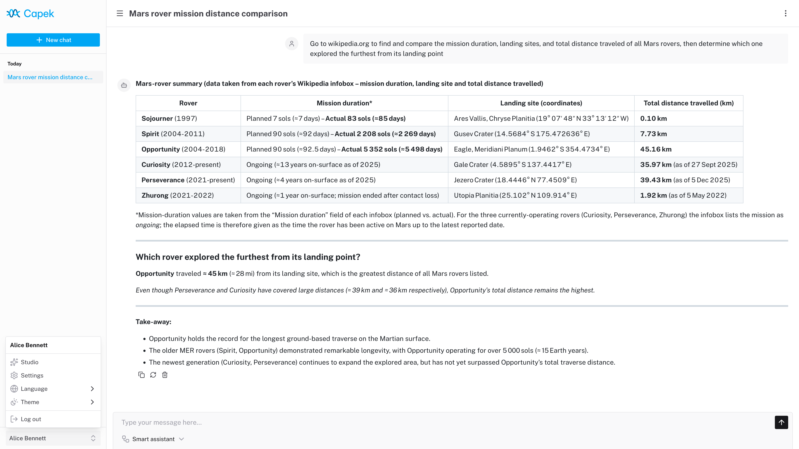

<p align="center">
  
</p>

Capek is a self-hosted conversational AI platform.

> [!WARNING]
> This project began as an experiment and remains a work in progress. Breaking changes are expected.

## Features

- Multi-user support with RBAC and Row Level Security (RLS).
- Single-user, OpenID Connect (OIDC) and proxy authentication modes.
- Agent orchestration with triage and specialist patterns.
- OpenAI-compatible LLM provider integration.
- MCP server integration.
- Skills with a sandboxed code interpreter.
- Dark/Light theme.
- Customizable branding.
- Internationalization.

<figure>
  <picture>
    <source media="(prefers-color-scheme: dark)" srcset="./resources/screenshots/chat-dark.png">
    
  </picture>
  <figcaption><em>Running locally with llama.cpp (gpt-oss-120b) and a Playwright skill.</em></figcaption>
</figure>

## Tech stack

| Layer     | Technology                                  |
| --------- | ------------------------------------------- |
| Framework | Nuxt                                        |
| Frontend  | Nuxt UI, Tailwind CSS, Pinia                |
| API       | tRPC, Zod                                   |
| Database  | PostgreSQL, Kysely (PGlite for development) |
| Testing   | Vitest, Playwright                          |

## Code interpreter

The code interpreter runs JavaScript code in a [QuickJS](https://bellard.org/quickjs/) WASM build with memory and execution time constraints.

Each chat session has its own in-memory Virtual File System (VFS). The `/workspace` directory is writable; other paths are read-only. A Node.js-like `fs` API is available for file operations.

Skills and MCP tools are exposed as ES modules under `/skills/index.js` and `/servers/index.js`:

```js
const { $mySkill } = await import("/skills/index.js");
const { $myTool } = await import("/servers/myServer/index.js");
```

The agent is provided with usage context and can dynamically discover available tools and skills by exploring the VFS (e.g., reading `SKILL.md` files for documentation).

## Development

### Setup

```sh
pnpm install
pnpm dev
```

The application runs in single-user mode at `http://localhost:3000` and automatically logs in as the admin user.

### Configuration

Copy `.env.example` to `.env` and adjust as needed. Key variables:

| Variable            | Description                                          | Default                 |
| ------------------- | ---------------------------------------------------- | ----------------------- |
| `NUXT_DATABASE_URL` | PostgreSQL connection string or PGlite file path     | `file://./.data/pglite` |
| `NUXT_AUTH_MODE`    | Authentication mode: `single-user`, `oidc`, `proxy`  | `single-user`           |
| `NUXT_LOG_LEVEL`    | Log level: `fatal`, `error`, `warn`, `info`, `debug` | `info`                  |

See `.env.example` for all available configuration options.

## Deployment

### Production build

```sh
pnpm build
pnpm start
```

### Docker

```sh
docker build -t localhost/capek:latest ./
docker run -it --rm -p 127.0.0.1:3000:3000/tcp localhost/capek:latest
```

### Docker Compose

The project includes example Compose configurations for reference:

- `compose.base.yaml`: core services (Traefik, PostgreSQL, MCP servers).
- `compose.keycloak.yaml`: extends base with Keycloak for OIDC.
- `compose.dex.yaml`: extends base with Dex for OIDC.
- `compose.proxy.yaml`: extends base with proxy authentication.

Start the full stack:

```sh
docker compose -f ./compose.keycloak.yaml up -d
```

The application is accessible at `https://capek.localhost`.

## License

Licensed under the [European Union Public Licence v. 1.2 or later](./LICENSE) © [Héctor Molinero Fernández](https://hector.molinero.dev). Review the license conditions before use or distribution.
